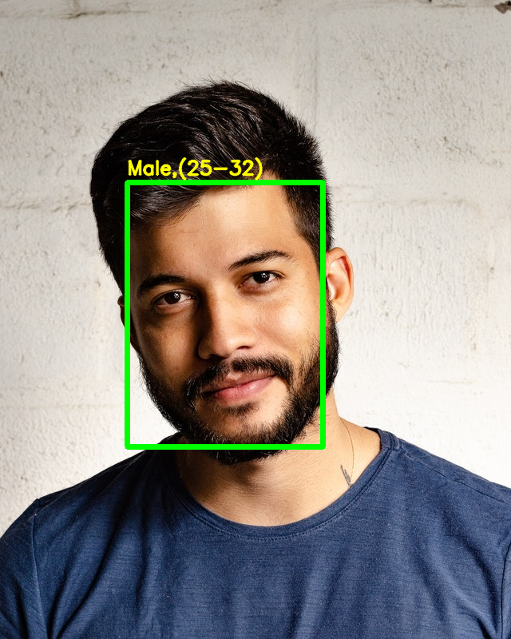

# Gender and Age Classification using OpenCV Deep Learning

## Gender and Age Classification using CNNs
The authors have used a very simple convolutional neural network architecture, similar to the CaffeNet and AlexNet. The network uses 3 convolutional layers, 2 fully connected layers and a final output layer. The details of the layers are given below.

Conv1 : The first convolutional layer has 96 nodes of kernel size 7.
Conv2 : The second conv layer has 256 nodes with kernel size 5.
Conv3 : The third conv layer has 384 nodes with kernel size 3.
The two fully connected layers have 512 nodes each.
They have used the Adience dataset for training the model.

### Gender Prediction
They have framed Gender Prediction as a classification problem. The output layer in the gender prediction network is of type softmax with 2 nodes indicating the two classes “Male” and “Female”.

### Age Prediction
Ideally, Age Prediction should be approached as a Regression problem since we are expecting a real number as the output. However, estimating age accurately using regression is challenging. Even humans cannot accurately predict the age based on looking at a person. However, we have an idea of whether they are in their 20s or in their 30s. Because of this reason, it is wise to frame this problem as a classification problem where we try to estimate the age group the person is in. For example, age in the range of 0-2 is a single class, 4-6 is another class and so on.

The Adience dataset has 8 classes divided into the following age groups [(0 – 2), (4 – 6), (8 – 12), (15 – 20), (25 – 32), (38 – 43), (48 – 53), (60 – 100)]. Thus, the age prediction network has 8 nodes in the final softmax layer indicating the mentioned age ranges.

It should be kept in mind that Age prediction from a single image is not a very easy problem to solve as the perceived age depends on a lot of factors and people of the same age may look pretty different in various parts of the world. Also, people try very hard to hide their real age!

## Models
Download models used from

Gender Net : https://www.dropbox.com/s/iyv483wz7ztr9gh/gender_net.caffemodel?dl=0"

Age Net : https://www.dropbox.com/s/xfb20y596869vbb/age_net.caffemodel?dl=0"

## Run Code

### Python
```
python AgeGender.py --input <input_file>(Leave blank for webcam)
```

## Sample Result


